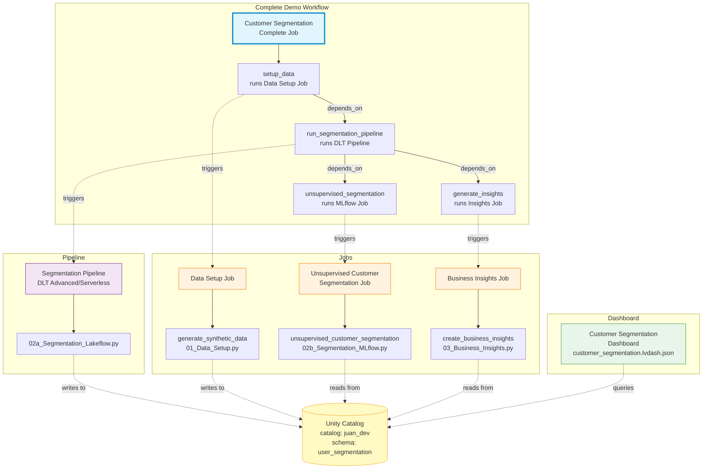

# Customer Segmentation Workflow Diagram



## Workflow Components

### 1. Individual Jobs
- **Data Setup Job**: Generates synthetic customer data
- **Business Insights Job**: Creates business insights from segmented data
- **Unsupervised Segmentation Job**: Runs MLflow-based customer segmentation

### 2. Pipeline
- **Segmentation Pipeline**: Delta Live Tables (DLT) pipeline that processes customer data
  - Edition: Advanced
  - Mode: Serverless
  - Trigger: Manual

### 3. Complete Demo Workflow
The main orchestration job that runs all components in sequence:
1. **setup_data**: Generates synthetic data
2. **run_segmentation_pipeline**: Processes data through DLT pipeline (full refresh)
3. **unsupervised_segmentation**: Runs ML segmentation (depends on pipeline)
4. **generate_insights**: Creates business insights (depends on pipeline)

### 4. Dashboard
- **Customer Segmentation Dashboard**: Visualizes the results from the pipeline and insights

### 5. Data Storage
All components read/write to Unity Catalog:
- Catalog: `juan_dev`
- Schema: `{user}_segmentation`
- Warehouse ID: `8baced1ff014912d`

## Execution Flow
```
Data Setup → DLT Pipeline → [Unsupervised Segmentation + Business Insights] → Dashboard
```
